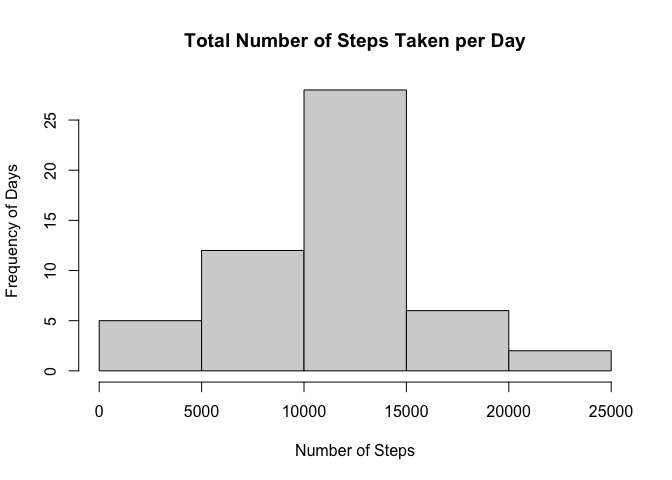
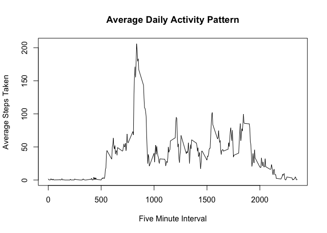
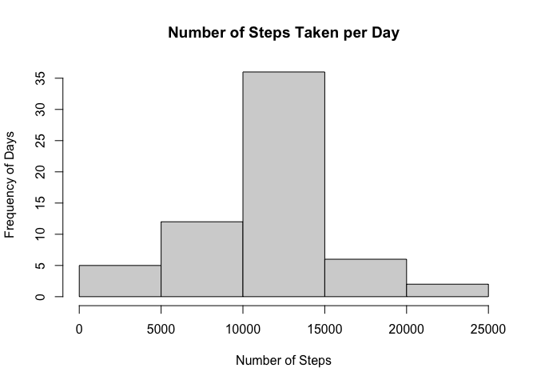
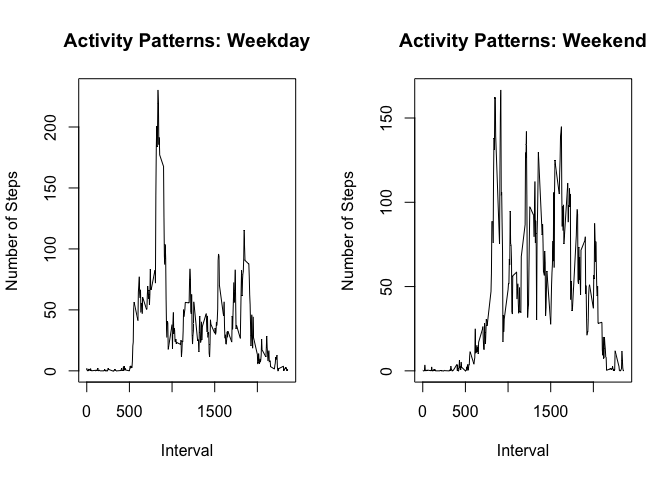

## Loading and preprocessing the data

```r
activity_data <- read.csv("activity.csv")
```


## What is mean total number of steps taken per day?
The following histogram shows the number of steps taken per day of tracking, followed by the mean number of steps taken per day, and lastly the median number of steps taken per day.

```r
sums <- tapply(activity_data$steps, activity_data$date, sum)
hist(sums, main = "Total Number of Steps Taken per Day", xlab = "Number of Steps", ylab = "Frequency of Days")
```

<!-- -->

```r
Mean <- mean(sums, na.rm = T)
print(Mean)
```

```
## [1] 10766.19
```

```r
Median <- median(sums, na.rm = T)
print(Median)
```

```
## [1] 10765
```


## What is the average daily activity pattern?
The following graph indicates the average number of steps taken over a five minute period over a series of days, followed by the maximum number of steps taken over a five minute interval. 

```r
StepIntervals <- aggregate(steps~interval, activity_data, mean, na.rm = T)
plot(StepIntervals$interval, StepIntervals$steps, type = "l", main = "Average Daily Activity Pattern", xlab = "Five Minute Interval", ylab = "Average Steps Taken")
```

<!-- -->

```r
MaxSteps <- max(StepIntervals$steps)
print(MaxSteps)
```

```
## [1] 206.1698
```


## Imputing missing values
The following histogram indicates the total number of steps taken per day. Any missing data was substituted with the average number of steps taken during the given five munite interval. This is graph is meant to be contrasted with the above graph of the same kind. Following the graph is the new average number of steps taken, and the new median number of steps taken. 

```r
print(sum(is.na(activity_data)))
```

```
## [1] 2304
```

```r
StepIntervals <- tapply(activity_data$steps, activity_data$interval, mean, na.rm = T)
splitdatameans <- split(activity_data, activity_data$interval)
for (i in 1:length(splitdatameans)) {
  splitdatameans[[i]]$steps[is.na(splitdatameans[[i]]$steps)] <- StepIntervals[i]
}
NewData <- do.call("rbind", splitdatameans)
NewData <- NewData[order(NewData$date), ]
NewDatasums <- tapply(NewData$steps, NewData$date, sum)
hist(NewDatasums, xlab = "Number of Steps", ylab = "Frequency of Days", main = "Number of Steps Taken per Day")
```

<!-- -->

```r
NewMean <- mean(NewDatasums, na.rm = T)
print(NewMean)
```

```
## [1] 10766.19
```

```r
NewMedian <- median(NewDatasums, na.rm = T)
print(NewMedian)
```

```
## [1] 10766.19
```


## Are there differences in activity patterns between weekdays and weekends?
The following graph contrasts the average number of steps over  given five minute intervals during the week and durng the weekend.  

```r
NewData$date <- as.Date(NewData$date)
NewData$Day <- weekdays(NewData$date, abbreviate = F)
NewData$DateCategory <- ifelse(NewData$Day %in% c("Saturday", "Sunday"), "Weekend", "Weekday")
StepIntervalsWeekday <- tapply(NewData[NewData$DateCategory == "Weekday", ]$steps, NewData[NewData$DateCategory == "Weekday", ]$interval, mean, na.rm = T)
StepIntervalsWeekend <- tapply(NewData[NewData$DateCategory == "Weekend", ]$steps, NewData[NewData$DateCategory == "Weekend", ]$interval, mean, na.rm = T)
par(mfcol = c(1,2))
plot(as.numeric(names(StepIntervalsWeekday)), StepIntervalsWeekday, type = "l", main = "Activity Patterns: Weekday", xlab = "Interval", ylab = "Number of Steps")
plot(as.numeric(names(StepIntervalsWeekend)), StepIntervalsWeekend, type = "l", main = "Activity Patterns: Weekend", xlab = "Interval", ylab = "Number of Steps")
```

<!-- -->
